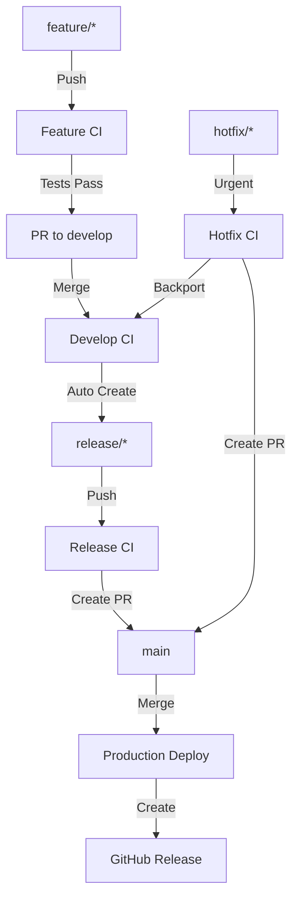

# GitHub Actions - Git Flow Automation

Este projeto utiliza GitHub Actions para automatizar o fluxo do Git Flow.

## 📋 Workflows Configurados

### 1. **Feature Branch CI** (`.github/workflows/feature.yml`)
**Trigger:** Push em `feature/*` ou PR para `develop`

**Ações:**
- ✅ Testa backend (.NET)
- ✅ Testa frontend (React)
- ✅ Valida mensagens de commit (Conventional Commits)
- ✅ Build de validação

### 2. **Develop CI/CD** (`.github/workflows/develop.yml`)
**Trigger:** Push em `develop`

**Ações:**
- ✅ Executa todos os testes
- ✅ Cria automaticamente branch `release/X.Y.0` quando pronto
- ✅ Incrementa versão automaticamente (minor)

### 3. **Release** (`.github/workflows/release.yml`)
**Trigger:** Push em `release/*`

**Ações:**
- ✅ Executa testes completos
- ✅ Cria Pull Request para `main` automaticamente
- ✅ Faz merge de volta para `develop`
- ✅ Valida build de produção

### 4. **Production Deployment** (`.github/workflows/main.yml`)
**Trigger:** Push em `main` ou criação de tag `v*`

**Ações:**
- 🚀 Build de produção (backend + frontend)
- 📦 Cria artifacts para deploy
- 🏷️ Cria release no GitHub com notas
- 📝 Gera tag automática se não existir

### 5. **Hotfix** (`.github/workflows/hotfix.yml`)
**Trigger:** Push em `hotfix/*`

**Ações:**
- 🚨 Testes rápidos de validação
- 📝 Cria PR para `main` (urgente)
- 📝 Cria PR para `develop` (backport)
- ⚡ Labels automáticas (hotfix, urgent)

---

## 🔄 Fluxo Automatizado



---

## 🚀 Como Usar

### 1. Desenvolver Feature
```bash
git flow feature start minha-feature

# Desenvolver...
git add .
git commit -m "feat: adicionar nova funcionalidade"

# Push dispara Feature CI
git push origin feature/minha-feature

# Criar PR para develop (manual ou após CI passar)
# Merge para develop dispara Develop CI
```

### 2. Release Automática
```bash
# Após merge em develop, o workflow cria automaticamente:
# - Branch: release/1.1.0
# - Incrementa versão minor

# Você só precisa:
git checkout release/1.1.0
git commit -m "chore: preparar release 1.1.0"
git push

# Workflow cria PR para main automaticamente
```

### 3. Deploy Produção
```bash
# Após merge do PR de release em main:
# - Deploy automático é executado
# - Tag v1.1.0 é criada
# - GitHub Release é publicado
# - Artifacts são gerados
```

### 4. Hotfix Urgente
```bash
git flow hotfix start 1.1.1

# Corrigir bug crítico
git commit -m "fix: corrigir erro crítico"
git push origin hotfix/1.1.1

# Workflow cria PRs automaticamente para main e develop
```

---

## ⚙️ Configuração Necessária

### Secrets do GitHub
Nenhum secret adicional necessário. O workflow usa `GITHUB_TOKEN` automático.

### Branch Protection Rules (Recomendado)

**Branch: `main`**
- ✅ Require pull request before merging
- ✅ Require status checks to pass
- ✅ Require branches to be up to date
- ✅ Include administrators

**Branch: `develop`**
- ✅ Require pull request before merging
- ✅ Require status checks to pass

**Pattern: `release/*`**
- ✅ Require status checks to pass

---

## 📊 Status Badges

Adicione ao README.md:

```markdown


```

---

## 🐛 Troubleshooting

### Workflow não executou
- Verifique se o arquivo `.yml` está em `.github/workflows/`
- Confirme que a branch corresponde ao trigger
- Verifique logs em Actions > Workflow Run

### Testes falhando
- Execute localmente: `dotnet test` (backend) e `npm test` (frontend)
- Verifique dependências atualizadas
- Confirme configurações de ambiente

### PR não foi criado automaticamente
- Verifique permissões do GITHUB_TOKEN
- Confirme que não existe PR aberto já
- Verifique logs do workflow

---

## 📚 Recursos

- [GitHub Actions Docs](https://docs.github.com/actions)
- [Git Flow](https://nvie.com/posts/a-successful-git-branching-model/)
- [Conventional Commits](https://www.conventionalcommits.org/)
